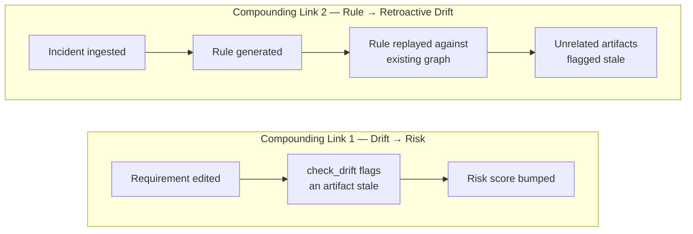
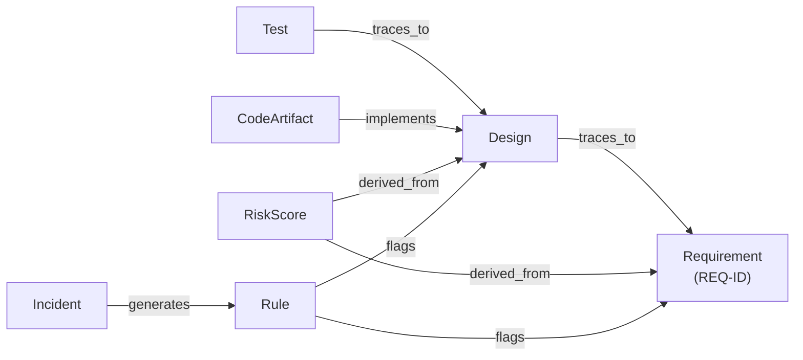
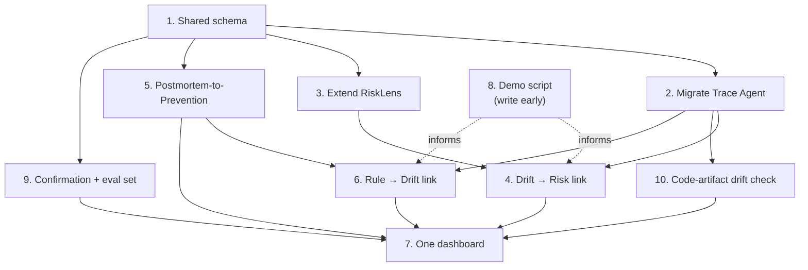
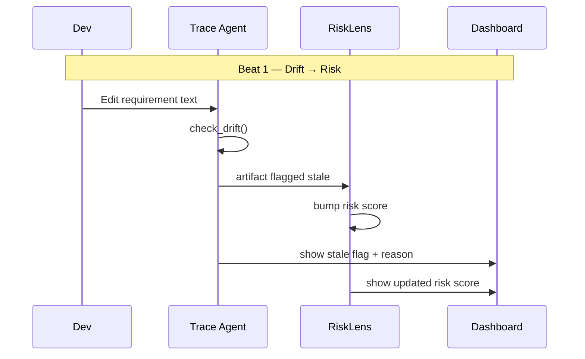
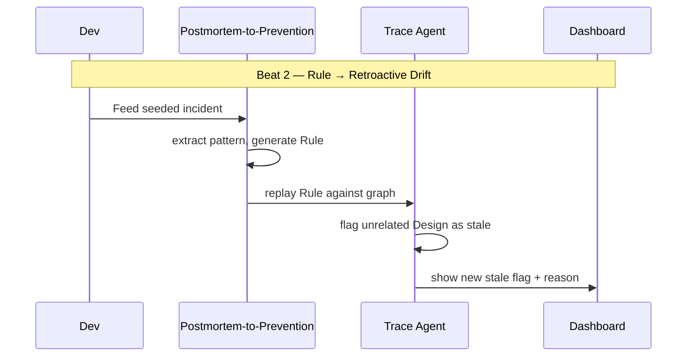

# SDLC Immune System — POC Build Spec

## What this is

Three modules — **Trace Agent** (catches requirement drift), **RiskLens** (predicts risk forward), and **Postmortem-to-Prevention** (learns backward from incidents) — unified by a shared requirement-ID backbone. The point is not three features sitting next to each other; it's that they **compound**: drift feeds risk, incidents generate rules, rules retroactively catch drift. Build order and dependencies below exist specifically to prove that compounding, not just ship three separate tools.

Trace Agent already exists as working code (`models.py`, `store.py`, `llm_client.py`, `prompts.py`, `pipeline.py`, `main.py`). RiskLens exists in some form (scores files/commits from git history). Postmortem-to-Prevention is new. **Extend existing code, don't rebuild it.**

## Core thesis — the two compounding links

This is the actual differentiator. Everything else is scaffolding to make these two things true and demoable:

1. **Drift → Risk.** When Trace Agent flags an artifact stale, that's not just a status label — it should bump the risk score for that requirement. A stale test is a live risk signal.
2. **Rule → Retroactive drift.** When Postmortem-to-Prevention generates a new rule from an incident, replay it against the *existing* artifact graph. Anything that violates the new rule gets flagged stale — using the same drift-report shape Trace Agent already produces.

If the POC only has time for one of these, build #1 first — it's cheaper and it's the minimum proof of the thesis.

## Architecture: shared graph schema

Lock this before any module-specific work starts. Every module reads and writes to one store, keyed by requirement ID.

**Nodes:**
- `Requirement` — the source of truth, has an ID (e.g. `REQ-2e9fa1`)
- `Design` — derived from a Requirement
- `Test` — derived from a Design
- `CodeArtifact` — active. Represents the actual implemented API surface for a Design, used by the code-artifact drift check (step 10)
- `RiskScore` — attached to a Requirement or Design node
- `Incident` — a postmortem/bug report, may or may not link to a REQ-ID
- `Rule` — a static-analysis rule or test template, generated from an Incident

**Edges:**
- `traces_to` — Design → Requirement, Test → Design (the existing Trace Agent relationship)
- `derived_from` — RiskScore → Requirement/Design
- `flags` — Rule → Requirement/Design (marks it stale/violating)

**Implementation note:** extend Trace Agent's existing `store.py` rather than standing up a second database. It's already keyed by REQ-ID — that's exactly the backbone this needs. Add the new node types (`RiskScore`, `Incident`, `Rule`) to the same store.

## Explicitly out of scope for this POC

Don't let the coding agent scope-creep into these — they're real gaps but not what the demo needs to prove:

- Multi-user support / auth (real fix is row-level locking or optimistic concurrency, ownership fields on nodes, a real transactional DB — standard, not interesting to demo, deliberately deferred to the roadmap)
- A production-grade database (the existing store's persistence approach is fine)
- Comprehensive test coverage of the tool itself
- Full static/dynamic analysis of code against requirements — step 10 below adds a partial version scoped to the Design's API surface, not a general solution

See "Known limitations and mitigations" at the end for what's being addressed in this POC vs. explicitly deferred.

## Build order

Steps are numbered in dependency order. "Parallelizable" means it can start as soon as the schema (step 1) is locked, independent of other steps.

### 1. Shared schema — blocking, do first
Agree and write down the node/edge schema above. Nothing else starts until this is settled. Small, boring, fast — that's the point.
**Done when:** schema is documented and the store's data model reflects it.

### 2. Migrate Trace Agent to the shared store — parallelizable after step 1
Point Trace Agent's existing read/writes at the shared store instead of (or in addition to) its standalone one. Should be a small change if step 1 absorbed its existing shape correctly.
**Done when:** Trace Agent's existing drift-check flow works unchanged, but data lives in the shared graph.

### 3. Extend RiskLens to score REQ-IDs — parallelizable after step 1
Today RiskLens presumably scores files/commits from git history. Extend it so a `RiskScore` node attaches to a `Requirement` or `Design` node in the shared graph, not just a filesystem path.
**Done when:** a Requirement in the shared store has a queryable risk score.

### 4. Compounding link #1 — drift → risk. Blocks on: 2, 3
When `check_drift()` flags an artifact stale, bump the risk score for its REQ-ID. This is one event handler, not a new module — don't over-build it.
**Done when:** editing a requirement in a way that causes drift visibly changes that requirement's risk score, not just its drift status.

### 5. Build Postmortem-to-Prevention — parallelizable after step 1
New pipeline stage, same shape as `analyze_requirement()`: ingest incident/postmortem text, ask the model to extract the general pattern, generate a `Rule` node (a static-analysis rule or test template). If the incident text references a known REQ-ID, link it; otherwise the Rule stands alone.
**Done when:** feeding in an incident produces a stored `Rule` node.

### 6. Compounding link #2 — rule → retroactive drift. Blocks on: 5, and the drift logic from 2
When a new `Rule` is generated, replay it against the existing artifact graph. Anything that violates it gets flagged stale, reusing the same drift-report shape `check_drift()` already produces — don't build a second reporting format.
**Done when:** generating a rule from a seeded incident visibly flags a *different*, previously-unrelated requirement's design as stale.

### 7. One dashboard — blocks on: everything above
Single view: this requirement is stale (Trace Agent) → here's why it's risky (RiskLens) → here's the new rule an old incident just generated, and here's what it just made stale (Postmortem loop). Don't let each module ship its own separate UI — the unified view is the actual pitch.
**Done when:** all three modules' state for a given REQ-ID is visible in one place.

### 8. Demo script — write early, not last
Two beats:
- **Beat one:** edit a requirement live → drift flags it stale → risk score jumps. (Proves compounding link #1.)
- **Beat two:** feed in a seeded historical incident → it generates a rule → that rule retroactively flags an unrelated requirement's design. (Proves compounding link #2.)

Write this script *before* finishing steps 4–7 so the team is building toward a specific demoable moment, not just "features."

### 9. Human-in-the-loop confirmation + eval set — parallelizable after step 1, mitigates the ground-truth gap
Two parts, build together:
- Don't auto-apply drift/risk status. Surface each model call ("stale," "risky," rule-generated) as a suggestion the dev confirms or overrides in the dashboard. Log every confirmation/override to the shared store. This log *is* your ground truth, and it accumulates for free as the tool gets used — no separate labeling effort required to start.
- Seed a small hand-labeled eval set: 15-20 requirement-edit scenarios with known correct stale/ok answers. Run the pipeline against them, report an actual agreement rate. Turns "the model decides" into a cited number for the pitch instead of an unverified claim.

**Done when:** every model judgment in the dashboard has a confirm/override control, overrides are logged, and there's a reported agreement rate against the seed eval set.

### 10. Code-artifact drift check — blocks on: 2 (needs the shared store's drift-report shape), parallelizable with 5, 9. Mitigates the text-edit-only limitation
Promote `CodeArtifact` from a placeholder node to an active one. Add a periodic (not edit-triggered) check that diffs a `CodeArtifact`'s actual API surface against its linked `Design`'s expected shape — e.g. Design says `filter + sort`, code only implements `filter` → flagged, even with zero requirement edits. Reuse the same drift-report shape `check_drift()` already produces; this is a second *trigger condition*, not a second system.

**Done when:** a code change that diverges from its Design (with no requirement edit involved) gets flagged stale through the same reporting path as text-driven drift.

Also swap mock mode for live LLM calls in the demo build, with a cached-response or retry fallback so a slow/flaky API call mid-demo doesn't break the pitch. This isn't a build step on its own — do it as part of wiring steps 2, 3, and 5 to real calls rather than as separate work.

## Parallelization summary

```mermaid
gantt
    title Build phases (relative order, not fixed dates)
    dateFormat X
    axisFormat %s
    section Phase 0
    1. Shared schema            :s1, 0, 1d
    section Phase 1 (parallel)
    2. Migrate Trace Agent      :s2, after s1, 2d
    3. Extend RiskLens          :s3, after s1, 2d
    5. Postmortem-to-Prevention :s5, after s1, 3d
    9. Confirmation + eval set  :s9, after s1, 2d
    8. Demo script              :s8, after s1, 1d
    section Phase 2
    4. Drift → Risk link        :s4, after s2 s3, 1d
    10. Code-artifact drift     :s10, after s2, 2d
    6. Rule → Drift link        :s6, after s5 s2, 1d
    section Phase 3
    7. One dashboard            :s7, after s4 s6 s9 s10, 2d
```

| Step | Depends on | Can run in parallel with |
|---|---|---|
| 1. Schema | — | — (must finish first) |
| 2. Migrate Trace Agent | 1 | 3, 5 |
| 3. Extend RiskLens | 1 | 2, 5 |
| 4. Drift → risk link | 2, 3 | 5 (until 5 is needed for 6) |
| 5. Postmortem-to-Prevention | 1 | 2, 3 |
| 6. Rule → drift link | 5, drift logic from 2 | — |
| 7. Dashboard | 2, 3, 4, 5, 6 | — |
| 8. Demo script | — (write in parallel with everything, early) | everything |
| 9. Confirmation + eval set | 1 | 2, 3, 5, 10 |
| 10. Code-artifact drift check | 2 | 5, 9 |

## Known limitations and mitigations

Say these out loud in the pitch on purpose rather than waiting to be asked — naming them reads as command of the material, not weakness.

| Limitation | Status | Mitigation |
|---|---|---|
| Mock mode gives canned answers, not live analysis | **Fixed** | Swap to live LLM calls for the demo build (bundled into steps 2, 3, 5), with a cached-response/retry fallback for reliability. |
| No ground truth for "stale"/"risky" model calls | **Partially mitigated** | Step 9: human confirm/override on every judgment (builds real ground truth over time) + a small hand-labeled eval set with a reported agreement rate. Not fully solved — it's model judgment made checkable, not verified. |
| Drift only caught on requirement-text edits, not silent code divergence | **Partially mitigated** | Step 10: periodic check diffs a CodeArtifact's actual API surface against its Design, using the same drift-report path. Scoped to API-surface mismatches, not full static/dynamic analysis. |
| Store isn't built for multiple concurrent users | **Deliberately deferred** | Real fix is standard (row-level locking or optimistic concurrency, ownership fields, a transactional DB) but not interesting to demo. Name it as a known roadmap item — spending POC time here trades against the compounding-links demo, which is the actual pitch. |
